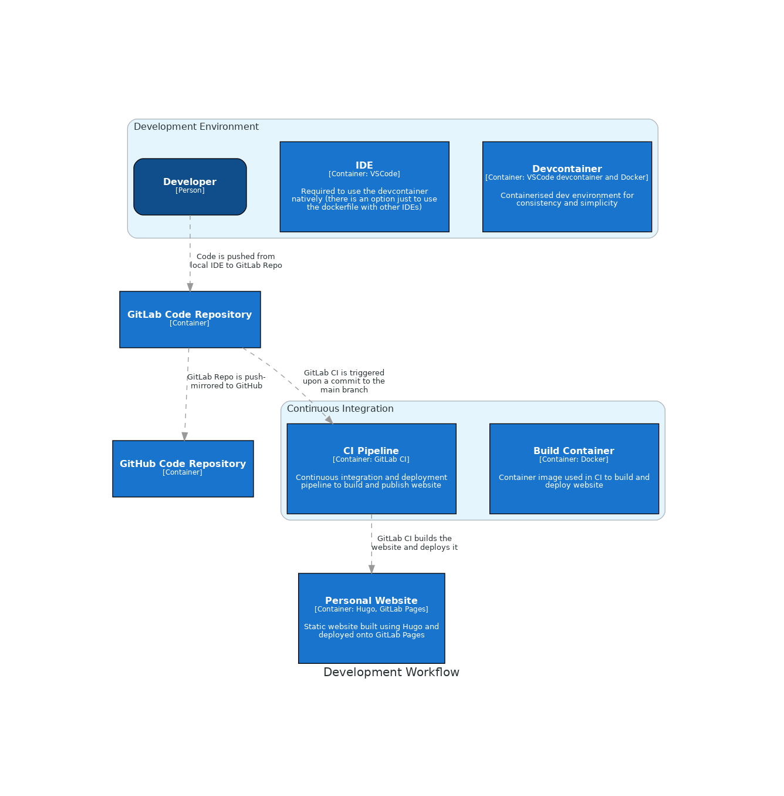

# Design: Development Experience for Personal Website

This document shows what the design will be for the development experience, from development environment setup to code commit to final deployment. It will also give insight into why certain technologies were used and particular decisions were made.

## Table of Contents

- [Objective of Build and Deployment System](#objective-of-build-and-deployment-system)
- [What the System will Look Like](#what-the-system-will-look-like)
  - [Assumptions](#assumptions)
  - [Overall Architecture](#overall-architecture)
- [Description and Reasoning for Choice of Components](#description-and-reasoning-for-choice-of-components)
  - [GitLab and GitHub](#gitlab-and-github)
  - [GitLab Pages](#gitlab-pages)
  - [Hugo](#hugo)
  - [VSCode and Devcontainer](#vscode-and-devcontainer)

## Objective of Build and Deployment System

To have a development experience that is quick to set up, automatically builds and tests the code committed and deploys the personal website to a reliable and low-maintenance system upon commit to the main branch.

## What the System will Look Like

### Assumptions

This architecture assumes good practices around branching and merging of commits to main is occurring, and thus these details aren't specified in the design.

### Overall Architecture

The overall architecture consists of:

- A development environment with a container for building and testing within
- Code repositories on GitLab and GitHub
- Continuous integration run through GitLab CI using a Built Container image defined in [this repository](https://gitlab.com)
- The website will be hosted on GitLab pages and is built with Hugo, a static website generator from markdown

Below is a diagram showing the workflow of developer writing the website, committing and pushing the code, that triggering both a mirror and CI pipeline, and then the final website being published.

## Description and Reasoning for Choice of Components

### GitLab and GitHub

GitLab is used as the main repository as it has easy integration with it's CI system which has access to publish to GitLab pages. GitHub is used as a mirror for redundancy as well as visibility of the project. More people have GitHub accounts so it's easier to privately share with them on this platform.

### GitLab Pages

This is the web-hosting platform of choice as it's free, which is a requirement for a personal website, and it allows custom domains on the free tier. Other hosting platforms such as netlify have been used previously as they were easy to set up, however, having more control over the deployment process and as a learning experience GitLab Pages and CI was a better fit.

### Hugo

Hugo uses markdown plus a custom defined tagging system to generate the HTML, JS and CSS required for a static website. It's pretty easy to install, open-source and simple to use and edit content from a local dev environment.

### VSCode and Devcontainer

VSCode is a very extensible IDE, which is simplistic and fairly approachable whilst also being quite powerful and customisable via the multitude of open-source extensions. Devcontainer is a well-integrated approach to creating a development environment with all necessary requirement to be able to build and test any project, allowing the developer to be setup quickly without having to carry out tedious repetitive steps to hopefully install everything correctly.
